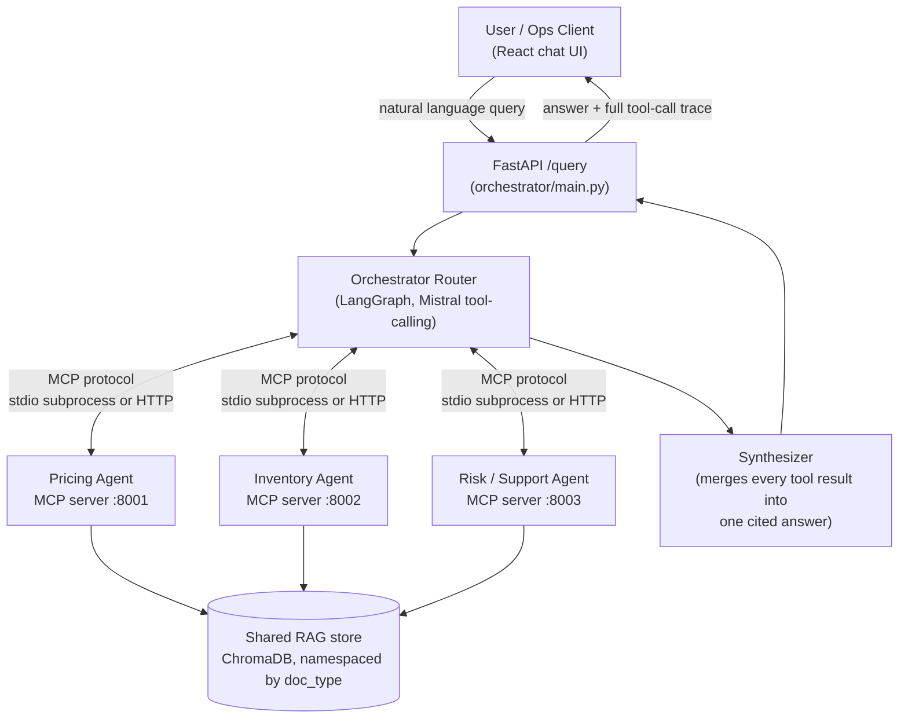

# MCP Marketplace Orchestrator

A simulated e-commerce marketplace backend where independent, specialized agents — pricing, inventory, and risk/support — each run behind their own **MCP server**, coordinated by a central **orchestrator agent** that routes natural-language requests to the right agent(s), grounds every answer in a shared **RAG** knowledge base, and combines multi-agent results into one coherent, cited response.

Built as a portfolio project to demonstrate the harder, more production-relevant problem most single-agent RAG demos skip: coordinating multiple independent services, each with their own tools and context, through a real protocol (MCP), with measured routing reliability instead of vibes.

Full design rationale: [PRD_MCP_Marketplace_Orchestrator.md](PRD_MCP_Marketplace_Orchestrator.md).

---

## Architecture



Each agent is a **separate OS process** — or, under Docker Compose, a **separate container** — speaking MCP, not a function call inside a monolith. The orchestrator is a real MCP *client*: it opens a session to all three agent servers at startup ([orchestrator/mcp_clients.py](orchestrator/mcp_clients.py)) and talks to them over the protocol (`initialize` → `list_tools` → `call_tool`), the same way Claude Desktop or any other MCP host would. A single query can legitimately require more than one agent (e.g. *"is it in stock, and should we discount it?"*) — the router loops tool-calling rounds so it can call pricing **and** inventory in one turn and synthesize both results into one answer.

---

## Agents & tools

| Agent | MCP tools | RAG grounding | SQL tables |
|---|---|---|---|
| **Pricing** | `get_price`, `suggest_discount`, `compare_competitor_price` | pricing policy + historical price-elasticity notes | `products` |
| **Inventory** | `check_stock`, `forecast_restock`, `flag_low_stock` | product catalog + warehouse policy | `products`, `inventory` |
| **Risk & Support** | `check_seller_risk`, `get_return_pattern`, `create_support_ticket`, `escalate` | fraud/return policy + historical flagged-seller cases | `sellers`, `orders`, `support_tickets` |

Every agent answers from **two** sources it does not own: the shared RAG corpus for policy, and the shared synthetic SQL store ([db/seed.sql](db/seed.sql), schema in [shared/db_models.py](shared/db_models.py)) for facts. Putting product records in one table rather than per-agent dictionaries fixed a real defect: pricing keyed products by slug (`iphone-15`) while inventory keyed the same products by SKU (`iph-15-base`), so `get_price("iphone-15")` answered while `check_stock("iphone-15")` insisted the product did not exist. Lookups now resolve either identifier to the same row.

---

## Grounding: retrieval that can say "I don't know"

RAG runs on a single **shared** ChromaDB collection namespaced by `doc_type` (`policy`, `catalog`, `historical_case`), so the pricing agent cannot retrieve risk-only documents. Three things make the grounding trustworthy rather than merely present ([rag/retriever.py](rag/retriever.py)):

**Hybrid retrieval.** Embedding search and BM25 run over the same namespace and are fused with Reciprocal Rank Fusion. RRF combines by *rank* rather than score, because BM25 produces unbounded term-frequency sums while cosine similarity lives in [-1, 1] — fusing those numerically would need an arbitrary normalisation that quietly favours the larger scale.

**A calibrated similarity floor.** Retrieval below `RAG_MIN_SIMILARITY` (default **0.30**) returns `INSUFFICIENT_GROUNDING` and **no documents at all**, instead of the nearest document however unrelated. The threshold was measured, not guessed:

| | top-1 cosine similarity |
|---|---|
| In-domain queries (6 measured) | **0.474 – 0.710** |
| Out-of-domain queries (6 measured) | **-0.019 – 0.099** |

0.30 sits in the empty band between those clusters with ~0.17 of margin either side. All six out-of-domain probes ("how do I bake sourdough bread", "capital city of France") are rejected; all six in-domain queries retrieve with citations.

**A confidence gate that computes something.** The retriever returns the best similarity as a number, and the Risk & Support agent compares it against the threshold before answering — so `escalate` fires on a *measurement*, not on the model's impression of how sure it feels. This is what [fraud_policy.md](rag/data/policies/fraud_policy.md) section 2 has always demanded ("Support and Risk agents must check model retrieval confidence"); until recently nothing in the code measured anything. Escalations now persist to `support_tickets` with the reason attached, because a human handoff nobody can find later is not a handoff.

---

## Prompt engineering — measured, not vibes

The orchestrator's system prompt is versioned ([orchestrator/prompts/](orchestrator/prompts/)) and scored against a hand-written eval set ([eval/eval_set.jsonl](eval/eval_set.jsonl), plus a held-out set the prompts were never tuned against) using [eval/run_eval.py](eval/run_eval.py), which runs every query through the **real** orchestrator (real Mistral API calls, real MCP subprocess calls) and checks routing correctness, tool-call correctness, and grounding/faithfulness.

| Prompt | Main set (35 queries) | Held-out set (14 queries, never tuned against) |
|---|---|---|
| v1 (baseline) | 94.3% routing / 94.3% tool / 100% grounded | — |
| v2 | 94.3% routing / 94.3% tool / 97.1% grounded | 85.7% routing / 78.6% tool / 100% grounded |
| **v3** | **97.1% routing / 97.1% tool / 94.3% grounded** | **92.9% routing / 92.9% tool / 100% grounded** |

The v3 main-set row was **re-measured** after the retrieval, SQL, and synthesizer changes described below, so it reflects the current system rather than the version the prompt was originally scored against. Its two failures are both worth naming rather than rounding away:

- **One was an infrastructure failure**, not a routing decision — a Mistral `ReadTimeout` that exhausted six retries. Excluding it, routing and tool selection are **34/34**. The harness now counts API errors separately and prints both figures, because scoring a network fault as a wrong tool choice makes a transient blip look like prompt regression.
- **One was a stale expectation.** A query about a seller with no record expected the literal header `"Historical return patterns"` — which the old tool emitted for *any* id, real or not, before attaching unrelated retrieved text. That is precisely the fabrication the audit below exists to catch, so the tool now answers "No seller found" and the eval expectation was corrected to match. Real sellers still produce the header.

v3 was written from a genuine failure analysis of v1/v2's real (not simulated) mistakes — discount/markdown queries that mentioned "stock" or "inventory" as context were getting misrouted to inventory tools, and analytical/threshold-style questions ("evaluate seller risk based on fraud policy thresholds") sometimes got no tool call at all. v3's held-out improvement over v2 (78.6% → 92.9% tool accuracy) is on queries the prompt was never shown, so it reflects real generalization rather than overfitting to the eval set.

A separate multi-agent eval set ([eval/eval_set_multiagent.jsonl](eval/eval_set_multiagent.jsonl)) verifies genuinely cross-domain queries reach more than one agent server in a single turn.

---

## Hallucination audit — and the bug it caught

PRD §11 sets a target of *zero hallucinated facts across a 20-query audit*. [eval/run_audit.py](eval/run_audit.py) runs [20 queries](eval/audit_set.jsonl) — 14 answerable, 6 deliberately unanswerable — through the live orchestrator and puts each answer beside the exact grounding that produced it. Adversarial queries are machine-scored (nothing supports them, so refusing is the only correct outcome); answerable ones are number-traced back to the retrieved context, and anything untraceable is flagged for human sign-off.

**The first run failed, and that was the point.** Three fabrications, all from one cause:

| Query | Model stated | Reality |
|---|---|---|
| Headphones competitor price | "BestBuy $29.99, Amazon $27.99, our price $32.99" | No competitor tracked; real price **$49.99** |
| Premium TV SKU + supplier | `PTV-4K-75X90L`, "TechVision Electronics" | **P-TV-65**, **Samsung Electronics** |
| Seller risk confidence | "below the 0.8 threshold" | Threshold is **0.30** |

The first two called **no tool at all**, then opened with *"based on the tool results"*. The cause was a single line: [synthesizer.py](orchestrator/synthesizer.py) instructed the model *"Based on the tool results above…"* unconditionally, so when nothing had been retrieved the prompt itself asserted evidence existed — and the model complied by inventing it. The neighbouring *"do NOT add information that was not in the tool results"* was powerless, because the prompt had already claimed there were results.

The fix is structural rather than a stronger instruction: **when no tool ran, the synthesizer returns a fixed refusal without calling the model at all.** The only reliable way to stop a model inventing facts it has no source for is not to ask it for an answer. The third case was fixed by making tool output state the threshold next to the confidence (`confidence 0.56 vs threshold 0.30 — PASSED`), since an unexplained number invites a plausible-sounding companion.

**Final run: 20/20 — 6/6 adversarial correctly refused, 14/14 answerable fully traceable, 0 hallucinations.** Report: [eval/results/hallucination_audit_v3.md](eval/results/hallucination_audit_v3.md).

One honest limitation: this audit measures *honesty, not usefulness* — a system that refused everything would score perfectly. Routing accuracy in the table above is what covers the other side.

---

## Transports: stdio and HTTP

Each agent server runs over **either** MCP transport, selected by `MCP_TRANSPORT`, with no other code difference:

| | `stdio` (default) | `http` (Docker) |
|---|---|---|
| How the orchestrator reaches an agent | spawns it as a child process, pipes JSON-RPC over stdin/stdout | connects to `http://<agent>:<port>/mcp` over the network |
| Used by | local dev, standalone agent testing, the eval harness | `docker compose up` |

This split exists because **a stdio pipe cannot cross a container boundary** — it binds a server to its parent process. Putting each agent in its own container therefore required a network transport, not just a Dockerfile. The same `server.py` runs in both modes ([shared/mcp_transport.py](shared/mcp_transport.py)), and on the client side only the connect call differs ([orchestrator/mcp_clients.py](orchestrator/mcp_clients.py)) — the router, synthesizer, prompts, and tool surfaces are identical either way.

---

## Quickstart

### Option A — Docker Compose (whole stack, one command)

```bash
copy .env.example .env       # then fill in MISTRAL_API_KEY
docker compose up --build
```

Five containers: three independent agent MCP servers, the orchestrator, and the UI.

| Service | URL |
|---|---|
| Chat UI | http://localhost:5173 |
| Orchestrator API | http://localhost:8000/health |
| Pricing / Inventory / Risk agents | http://localhost:{8001,8002,8003}/mcp |

Each agent port is published deliberately, so any agent can be exercised as a standalone MCP server — with MCP Inspector or any other client — without the orchestrator running at all. Only the orchestrator container receives `MISTRAL_API_KEY`; the agents never call a model, so they are never handed the credential.

The orchestrator waits on each agent's healthcheck before starting, since it opens all three MCP sessions during FastAPI startup. First build is slow (each agent image installs ChromaDB).

### Option B — Run directly

#### 1. Backend

```bash
python -m venv venv
venv\Scripts\activate        # Windows; use `source venv/bin/activate` on macOS/Linux
pip install -r requirements.txt

copy .env.example .env       # then fill in MISTRAL_API_KEY
```

Build the two data stores (each only needed once, or after editing their sources):

```bash
python rag/ingest.py          # RAG vector store, from rag/data/
python db/seed_database.py    # synthetic SQLite store, from db/seed.sql
```

Both are idempotent. `rag/ingest.py` rebuilds from empty and uses deterministic document IDs, so re-running it can no longer silently duplicate the corpus; `db/seed_database.py` seeds only when the database is empty, with `--force` to rebuild deliberately. The agents also seed the database lazily on first query, so a fresh clone works without the second command.

Run the orchestrator API. It spawns all 3 MCP agent servers as subprocesses on startup (each imports ChromaDB, so first boot takes up to ~1 minute):

```bash
python orchestrator/main.py
# -> FastAPI on http://localhost:8000, POST /query {"query": "..."}
```

Each agent server can also be run and tested completely standalone, proving the architecture is genuinely modular:

```bash
cd agents/pricing_agent && python server.py
```

#### 2. Frontend

```bash
cd frontend
npm install
npm run dev
# -> http://localhost:5173
```

The chat UI shows the synthesized answer plus a live **agent trace panel** — the sequence of MCP tool calls (which agent, which tool, arguments, raw result) that produced it, so multi-agent composition is visible, not just claimed.

#### 3. Eval harness

```bash
python eval/run_eval.py --prompt v3 --output v3.csv
python eval/run_eval.py --prompt v3 --output holdout_v3.csv --eval_file eval_set_holdout.jsonl
```

Results land in `eval/results/*.csv` with per-query routing/tool/grounding verdicts.

---

## Project structure

```
docker-compose.yml       # 5 services: 3 agent servers + orchestrator + UI
agents/
  pricing_agent/         # MCP server: get_price, suggest_discount, compare_competitor_price
  inventory_agent/       # MCP server: check_stock, forecast_restock, flag_low_stock
  risk_support_agent/    # MCP server: check_seller_risk, get_return_pattern, create_support_ticket, escalate
                         # (each with its own Dockerfile — independently buildable/runnable)
orchestrator/
  mcp_clients.py         # MCP client pool — connects to the 3 agent servers over stdio or HTTP
  router.py              # LangGraph router: Mistral tool-calling loop, multi-agent composition
  synthesizer.py         # Merges every tool result into one cited final answer
  main.py                # FastAPI HTTP interface
  prompts/               # Versioned system prompts (v1 -> v2 -> v3)
  Dockerfile
rag/
  data/                   # Synthetic policy docs, catalog, historical cases (all clearly synthetic)
  retriever.py            # Hybrid BM25 + embedding retrieval, RRF fusion, similarity floor
  ingest.py               # Idempotent ingestion (deterministic IDs, rebuild-from-empty)
  vectorstore_client.py   # Shared Chroma collection (cosine space)
db/
  seed.sql                # Synthetic products/inventory/sellers/orders (data only)
  seed_database.py        # Builds db/marketplace.db; --force to rebuild
eval/
  eval_set.jsonl                # main eval set
  eval_set_holdout.jsonl        # held-out set, never used to tune prompts
  eval_set_multiagent.jsonl     # cross-agent composition checks
  audit_set.jsonl               # 20-query hallucination audit (15 grounded + 5 adversarial)
  run_eval.py / run_audit.py / results/
frontend/
  src/App.tsx, components/ChatWindow.tsx, components/AgentTraceViewer.tsx
  Dockerfile / nginx.conf       # multi-stage build -> static assets served by nginx
shared/
  config.py, mistral_utils.py   # retry/backoff on Mistral rate limits
  mcp_transport.py              # stdio-vs-HTTP transport switch used by all 3 agents
```

---

## Tech stack

| Layer | Choice |
|---|---|
| Agent orchestration | LangGraph |
| MCP servers | Python `mcp` SDK (via FastMCP), one process per agent |
| LLM | Mistral API (tool use) |
| Vector store | ChromaDB (cosine), namespaced by `doc_type` |
| Retrieval | Hybrid — ChromaDB embeddings + BM25 (`rank-bm25`), fused with RRF, gated by a similarity floor |
| Structured store | SQLite via SQLAlchemy — synthetic products, inventory, sellers, orders, tickets |
| Backend API | FastAPI |
| Frontend | React + TypeScript (Vite), chat + agent-trace viewer |
| Eval harness | Custom Python script, results as CSV |
| Packaging | Docker Compose — each MCP server its own container, reached over HTTP transport |

---

## What's synthetic

All product prices, stock levels, seller records, and policy documents are synthetic data generated for this demo — no real marketplace, sellers, or transactions are involved.

## Status against the original plan

Phases 1–5 of the [PRD](PRD_MCP_Marketplace_Orchestrator.md) are implemented and verified end-to-end (independent MCP servers, real MCP client-server orchestration, multi-agent composition, a measured prompt-eval pipeline, and this frontend).

Phase 6 (containerization) is written: HTTP transport for all three agents, per-agent Dockerfiles, an orchestrator image, a multi-stage frontend image, and the Compose topology. The HTTP transport itself is verified — all three agents were run as separate network-listening servers and reached by the orchestrator's MCP client pool over `http://localhost:{8001,8002,8003}/mcp`, with RAG grounding intact — and stdio was re-verified as unchanged. The **container images themselves have not been built or run yet** (no Docker daemon on the development machine), so the Dockerfiles and Compose file should be treated as unvalidated until someone runs `docker compose up --build`.

PRD §7 (hybrid retrieval, similarity threshold), §5/§9 (synthetic SQL store), and §6.4 (a confidence gate that actually computes a confidence) are implemented and verified — see [Grounding](#grounding-retrieval-that-can-say-i-dont-know) above.

Still open: a demo GIF for this README, and building the container images.
