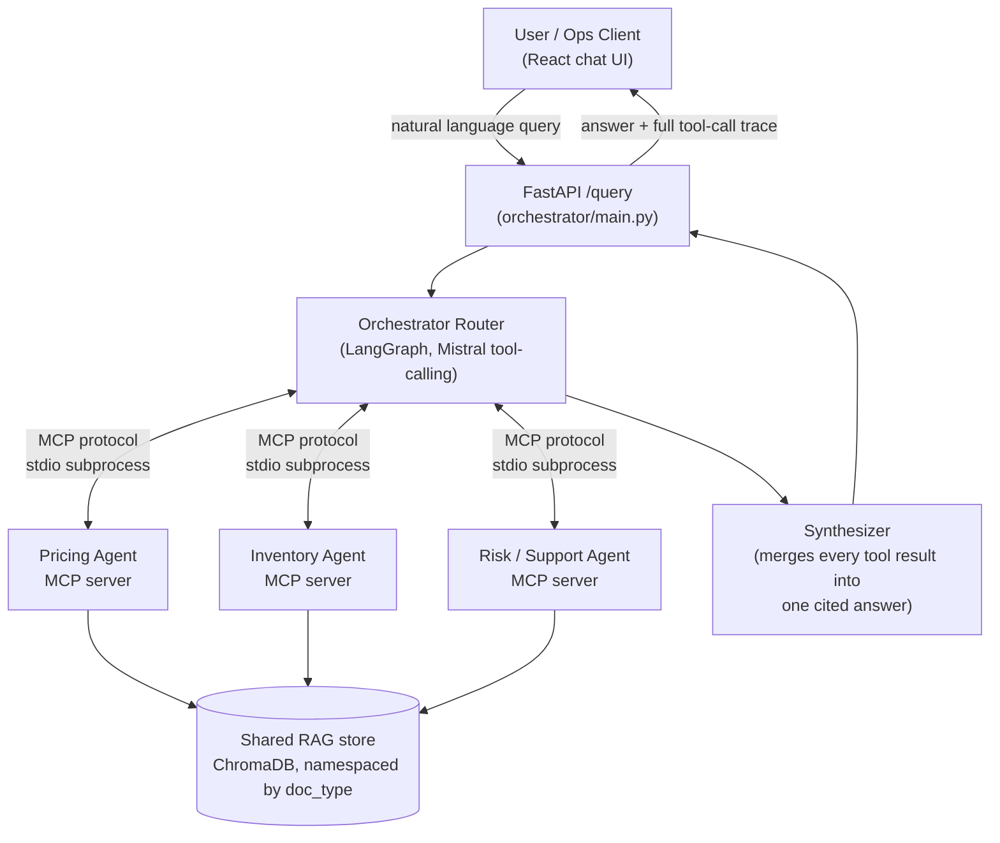

# MCP Marketplace Orchestrator

A simulated e-commerce marketplace backend where independent, specialized agents — pricing, inventory, and risk/support — each run behind their own **MCP server**, coordinated by a central **orchestrator agent** that routes natural-language requests to the right agent(s), grounds every answer in a shared **RAG** knowledge base, and combines multi-agent results into one coherent, cited response.

Built as a portfolio project to demonstrate the harder, more production-relevant problem most single-agent RAG demos skip: coordinating multiple independent services, each with their own tools and context, through a real protocol (MCP), with measured routing reliability instead of vibes.

Full design rationale: [PRD_MCP_Marketplace_Orchestrator.md](PRD_MCP_Marketplace_Orchestrator.md).

---

## Architecture



Each agent is a **separate OS process** speaking MCP over stdio — not a function call inside a monolith. The orchestrator is a real MCP *client*: it spawns all three agent servers as subprocesses at startup ([orchestrator/mcp_clients.py](orchestrator/mcp_clients.py)) and talks to them over the protocol (`initialize` → `list_tools` → `call_tool`), the same way Claude Desktop or any other MCP host would. A single query can legitimately require more than one agent (e.g. *"is it in stock, and should we discount it?"*) — the router loops tool-calling rounds so it can call pricing **and** inventory in one turn and synthesize both results into one answer.

---

## Agents & tools

| Agent | MCP tools | RAG grounding |
|---|---|---|
| **Pricing** | `get_price`, `suggest_discount`, `compare_competitor_price` | pricing policy + historical price-elasticity notes |
| **Inventory** | `check_stock`, `forecast_restock`, `flag_low_stock` | product catalog + warehouse policy |
| **Risk & Support** | `check_seller_risk`, `get_return_pattern`, `create_support_ticket`, `escalate` | fraud/return policy + historical flagged-seller cases |

The Risk & Support agent includes a **confidence-gated escalation rule**: ambiguous, low-confidence, or policy-edge-case situations get handed to `escalate` (a human handoff) instead of the model guessing — a deliberate reliability feature, not just a routing choice.

RAG runs on a single **shared** ChromaDB collection, namespaced by `doc_type` (`policy`, `catalog`, `historical_case`) so, e.g., the pricing agent can't accidentally retrieve risk-only documents.

---

## Prompt engineering — measured, not vibes

The orchestrator's system prompt is versioned ([orchestrator/prompts/](orchestrator/prompts/)) and scored against a hand-written eval set ([eval/eval_set.jsonl](eval/eval_set.jsonl), plus a held-out set the prompts were never tuned against) using [eval/run_eval.py](eval/run_eval.py), which runs every query through the **real** orchestrator (real Mistral API calls, real MCP subprocess calls) and checks routing correctness, tool-call correctness, and grounding/faithfulness.

| Prompt | Main set (35 queries) | Held-out set (14 queries, never tuned against) |
|---|---|---|
| v1 (baseline) | 94.3% routing / 94.3% tool / 100% grounded | — |
| v2 | 94.3% routing / 94.3% tool / 97.1% grounded | 85.7% routing / 78.6% tool / 100% grounded |
| **v3** | **97.1% routing / 97.1% tool / 100% grounded** | **92.9% routing / 92.9% tool / 100% grounded** |

v3 was written from a genuine failure analysis of v1/v2's real (not simulated) mistakes — discount/markdown queries that mentioned "stock" or "inventory" as context were getting misrouted to inventory tools, and analytical/threshold-style questions ("evaluate seller risk based on fraud policy thresholds") sometimes got no tool call at all. v3's held-out improvement over v2 (78.6% → 92.9% tool accuracy) is on queries the prompt was never shown, so it reflects real generalization rather than overfitting to the eval set.

A separate multi-agent eval set ([eval/eval_set_multiagent.jsonl](eval/eval_set_multiagent.jsonl)) verifies genuinely cross-domain queries reach more than one agent server in a single turn.

---

## Quickstart

### 1. Backend

```bash
python -m venv venv
venv\Scripts\activate        # Windows; use `source venv/bin/activate` on macOS/Linux
pip install -r requirements.txt

copy .env.example .env       # then fill in MISTRAL_API_KEY
```

Ingest the RAG knowledge base (only needed once, or after editing `rag/data/`):

```bash
python rag/ingest.py
```

Run the orchestrator API. It spawns all 3 MCP agent servers as subprocesses on startup (each imports ChromaDB, so first boot takes up to ~1 minute):

```bash
python orchestrator/main.py
# -> FastAPI on http://localhost:8000, POST /query {"query": "..."}
```

Each agent server can also be run and tested completely standalone, proving the architecture is genuinely modular:

```bash
cd agents/pricing_agent && python server.py
```

### 2. Frontend

```bash
cd frontend
npm install
npm run dev
# -> http://localhost:5173
```

The chat UI shows the synthesized answer plus a live **agent trace panel** — the sequence of MCP tool calls (which agent, which tool, arguments, raw result) that produced it, so multi-agent composition is visible, not just claimed.

### 3. Eval harness

```bash
python eval/run_eval.py --prompt v3 --output v3.csv
python eval/run_eval.py --prompt v3 --output holdout_v3.csv --eval_file eval_set_holdout.jsonl
```

Results land in `eval/results/*.csv` with per-query routing/tool/grounding verdicts.

---

## Project structure

```
agents/
  pricing_agent/        # MCP server: get_price, suggest_discount, compare_competitor_price
  inventory_agent/       # MCP server: check_stock, forecast_restock, flag_low_stock
  risk_support_agent/    # MCP server: check_seller_risk, get_return_pattern, create_support_ticket, escalate
orchestrator/
  mcp_clients.py         # MCP client pool — spawns & talks to the 3 agent servers over stdio
  router.py              # LangGraph router: Mistral tool-calling loop, multi-agent composition
  synthesizer.py          # Merges every tool result into one cited final answer
  main.py                 # FastAPI HTTP interface
  prompts/                # Versioned system prompts (v1 -> v2 -> v3)
rag/
  data/                   # Synthetic policy docs, catalog, historical cases (all clearly synthetic)
  ingest.py / retriever.py / vectorstore_client.py
eval/
  eval_set.jsonl                # main eval set
  eval_set_holdout.jsonl        # held-out set, never used to tune prompts
  eval_set_multiagent.jsonl     # cross-agent composition checks
  run_eval.py / results/
frontend/
  src/App.tsx, components/ChatWindow.tsx, components/AgentTraceViewer.tsx
shared/
  config.py, mistral_utils.py   # retry/backoff on Mistral rate limits
```

---

## Tech stack

| Layer | Choice |
|---|---|
| Agent orchestration | LangGraph |
| MCP servers | Python `mcp` SDK (via FastMCP), one process per agent |
| LLM | Mistral API (tool use) |
| Vector store | ChromaDB, namespaced by `doc_type` |
| Backend API | FastAPI |
| Frontend | React + TypeScript (Vite), chat + agent-trace viewer |
| Eval harness | Custom Python script, results as CSV |

---

## What's synthetic

All product prices, stock levels, seller records, and policy documents are synthetic data generated for this demo — no real marketplace, sellers, or transactions are involved.

## Status against the original plan

Phases 1–5 of the [PRD](PRD_MCP_Marketplace_Orchestrator.md) are implemented and verified end-to-end (independent MCP servers, real MCP client-server orchestration, multi-agent composition, a measured prompt-eval pipeline, and this frontend). Docker Compose packaging (Phase 6) is not yet done — today each piece runs directly via Python/npm as shown above.
